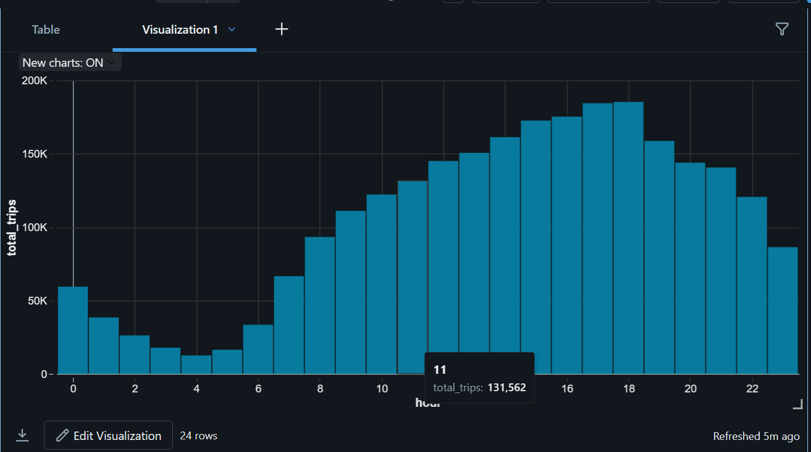

# NYC Taxi Data Engineering Pipeline

This repository contains my personal   NYC Taxi Data Engineering Pipeline   project. The project processes NYC Yellow Taxi trip data using   PySpark and Databricks   and follows a Bronze → Silver → Gold data pipeline architecture.

This is one of my projects in my Data Engineering journey.

## Project Overview

The pipeline processes NYC Yellow Taxi trip data and performs:

- Data ingestion
- Data quality checks
- Data cleaning and transformation
- Parquet partitioning
- Aggregations and analytics
- Spark SQL analysis
- Performance analysis using Spark execution plans

## Architecture

```text
NYC Taxi Parquet Data
        ↓
     Bronze
        ↓
     Silver
        ↓
      Gold
        ↓
    Analytics
```

### Bronze Layer
Raw NYC Taxi data is loaded into Databricks from Parquet files.

### Silver Layer
The data is cleaned and transformed by:

- Handling NULL values
- Removing invalid records
- Removing duplicate records
- Validating trip and fare values
- Converting data types
- Creating partitioned Parquet data

### Gold Layer

The cleaned data is aggregated into analytical datasets:

- Hourly average fare
- Trips by pickup zone
- Average tip percentage by day
- Peak demand hours

### Analytics Layer

Spark SQL and DataFrame operations are used to analyze the Gold datasets and generate insights such as:

- Top demand hours
- Daily trip counts
- Running total of trips
- Demand ranking by pickup zone

## Performance Check

I analyzed Spark execution plans using `.explain(True)`.

I also compared a date-based query on non-partitioned and partitioned Parquet data.

| Approach | Execution Time |
|---|---:|
| Without Partition | 2.6218 seconds |
| With Partition | 3.2901 seconds |

The execution plan for the partitioned query showed `PartitionFilters` on `pickup_date`, confirming that Spark was able to apply partition pruning.

In this particular test, the partitioned query was slower. Execution time can be affected by factors such as caching, cluster startup, and execution overhead. Partitioning is still useful for queries that frequently filter on the partition column, especially as data size grows.

## Technologies Used

- Python
- PySpark
- Apache Spark
- Databricks
- Spark SQL
- Pandas
- Requests
- Parquet
- Git & GitHub

## Project Structure

```text
nyc-taxi-pipeline/
│
├── data/
│   └── raw/
│       ├── .gitkeep
│       └──  .parquet
│
├── databricks/
│   ├── 01_ingestion.py
│   ├── 02_bronze_to_silver.py
│   ├── 03_silver_to_gold.py
│   └── 04_analytics_sql.py
│
├── docs/
│   └── columns_notes.md
│
├── scripts/
│   └── download_data.py
│
├── sql/
│   └── analysis_queries.sql
│
├── .gitignore
├── README.md
└── requirements.txt
```

## Data Source

The project uses the   NYC Yellow Taxi Trip Record Data   provided by the New York City Taxi and Limousine Commission (TLC).

The raw data is provided in Parquet format.

## How to Run

### 1. Clone the repository

```bash
git clone <your-github-repository-url>
cd nyc-taxi-pipeline
```

### 2. Install dependencies

```bash
pip install -r requirements.txt
```

### 3. Download the data

Run:

```bash
python scripts/download_data.py
```

The raw Parquet files are stored in:

```text
data/raw/
```

### 4. Run the Databricks pipeline

Upload the raw data to a Databricks Volume and execute the notebooks/scripts in the following order:

```text
01_ingestion.py
        ↓
02_bronze_to_silver.py
        ↓
03_silver_to_gold.py
        ↓
04_analytics_sql.py
```

## Key Data Engineering Concepts Practiced

Through this project I practiced:

- ETL / ELT pipeline design
- PySpark DataFrame API
- Spark SQL
- Data cleaning
- Data validation
- Parquet file format
- Partitioning
- Partition pruning
- Aggregations
- Window functions
- Execution plan analysis
- Performance comparison
- Databricks Volumes
- Git and GitHub project organization

## Visualization

### Trips by Hour

The chart below shows the distribution of taxi trips across different hours of the day.



## Future Improvements

Planned improvements include:

- Processing multiple months automatically
- Adding more analytical datasets
- Adding NYC Taxi Zone lookup data
- Implementing broadcast joins with lookup data
- Adding data quality metrics
- Adding visualizations
- Improving pipeline automation
- Scheduling the pipeline

## Author

  Kapil Prajapat  

BCA Student | Aspiring Data Engineer